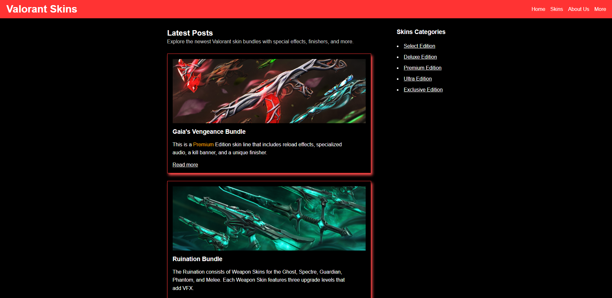

# Valorant Skins – HTML/CSS Practice Project

This is a simple and visually styled website showcasing a selection of Valorant weapon skin bundles. It was created as a **personal project to practice HTML and CSS** concepts learned in college.

The project focuses on structure, layout, responsive design, and interactivity using only HTML and CSS.

---

## Features

- Clean, semantic HTML structure
- Responsive layout with Flexbox and media queries
- Sidebar with anchor navigation
- Hover effects and alert-based feedback for interactivity
- Thematic styling based on Valorant’s aesthetic (black, red, gold)
- Basic accessibility and visual hierarchy

---

## Preview

> 

---

## How to Use

1. Clone or download the repo
2. Open `index.html` in your browser
3. Explore the layout and hover interactions

---

## Image Attribution

The skin images used in this project were found online and are property of **Riot Games**. They are used here **for educational and non-commercial purposes only**.

This website is **not affiliated with or endorsed by Riot Games**. All trademarks and assets belong to their respective owners.

---

## Tools Used

- HTML5
- CSS3
- VS Code

---

## Conclusion

This project was created as part of my **web development learning journey** and portfolio-building process.  
It showcases my ability to build responsive static websites from scratch using just HTML and CSS.

Thank you for checking out my project!

